# aw10-final实验要求

**以下要求在实验报告中都有所阐释**（给了坐标）

Please develop a **fully functional** online purchase order system.

- It should have a superb collection of goods merchandises（见spring-bacth）
- Customer can browse/search for merchandises, add selected one into his shopping cart and checkout to complete a transaction.（见product-service的api设计及结果展示）
- User can get delivery status updates continuously（见pos-carts和pos-orders之间的api设计，他们通过message channel和spring integration交互以达到此目的）.

The system should be of a **reactive architecture**, which means it should be

-  Responsive: it should response to the user request timely.
-  Resilient: it should not be easily broken down.
-  Elastic: it should be flexible to scale out.
-  Message Driven: it should has loosely coupled components that communicates with each other asynchronously.

Please design tests/experiements to demostrate that your system fulfills such requirements as stated in [The Reactive Manifesto](https://www.reactivemanifesto.org)

**Submit your codes/documents/tests/experiements of your system.**

---

# AW10实验报告

## 主要模块及技术栈

+ pos-batch ：用于处理amazon的数据集并持久化到数据库。

    + spring-batch
    + spring-data-jpa+mysql

+ pos-products： 用于有选择地展示商品

    + spring-data-r2dbc
    + spring-webflux
    + spring-cloud-netflix

+ pos-carts：用于添加商品以及生成订单

    + rabbit-mq
    + spring-data-r2dbc
    + spring-cloud-netflix
    + spring-integration

+ pos-order：用于计算订单价格以及确定订单状态，不和前两者连接

    + rabbit-mq
    + spring-data-r2dbc
    + spring-cloud-netflix

+ pos-gateway：用于forward和route

    + spring-gateway
    + hystrix
    + spring-cloud-netflix

+ pos-discovery：用于发现以及提供服务的ip和端口

    + spring-cloud-netflix

+ 整体架构如下图（有点丑陋）

  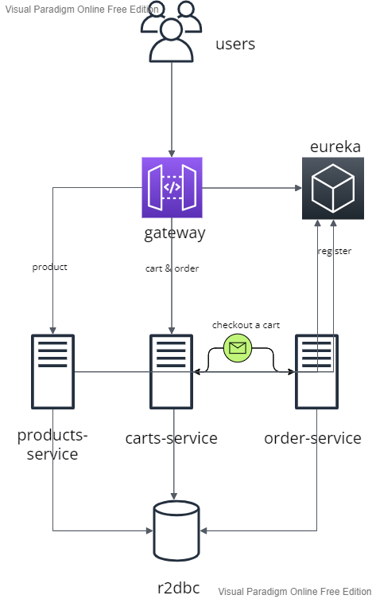

## 运行前准备

+ 先建立数据库
+ 再运行rabbitmq的docker（使用start-server.sh)
+ 再运行spring batch，注意准备好亚马逊的数据集（太大没有传，用的软件和游戏那个数据集），**并在batch中修改其位置**。
+ 最后运行几个微服务

## 提供的api以及运行结果展示

**因为配置较为复杂,且github无法传太大的数据集，所以这里将所有api以及运行结果一并展示**

+ pos-batch（直接运行即可）

  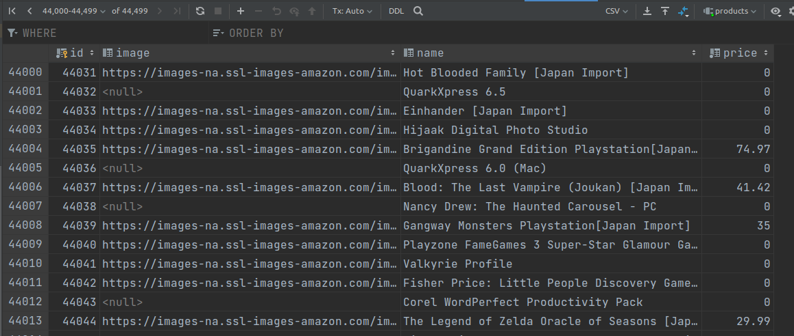
  可以看到运行后数据库已经有45000条数据（在我个人机子上勉强符合有大量数据的标准）

+ products-service(显示时过滤掉了没有价格的商品)

  `GET: /api/products/`

  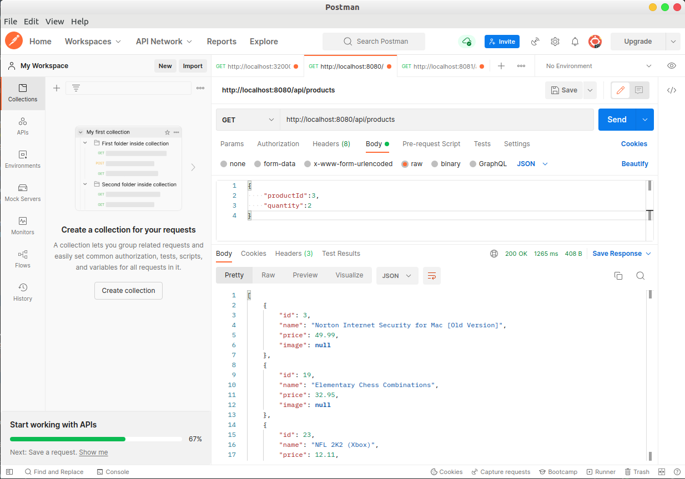

  `GET: /products/{offset}/{limit}`

  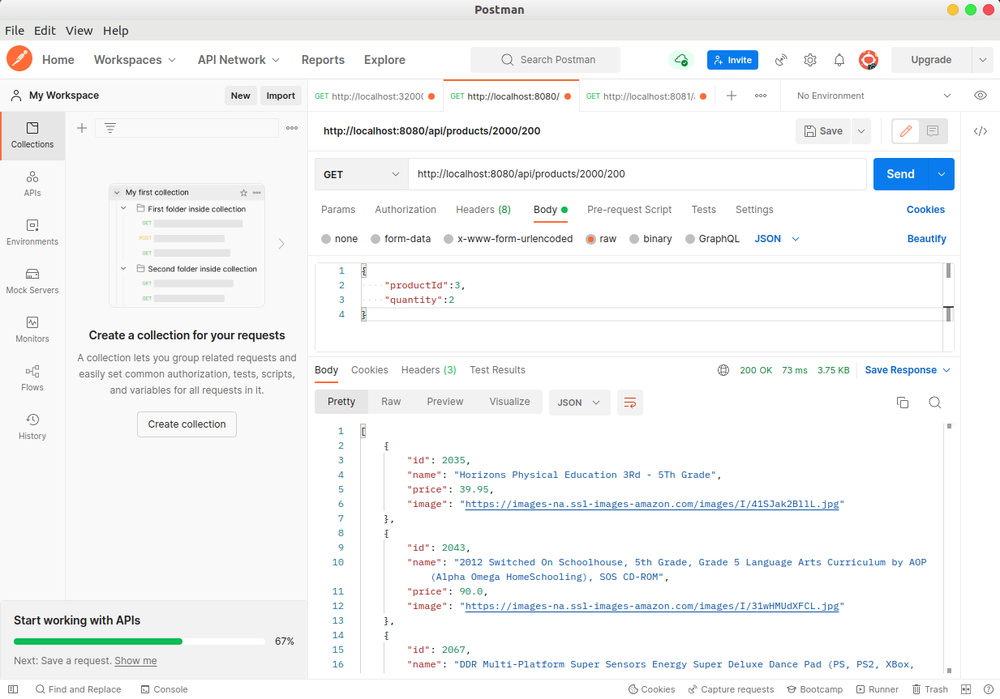

  `GET: /products/{productId}`

  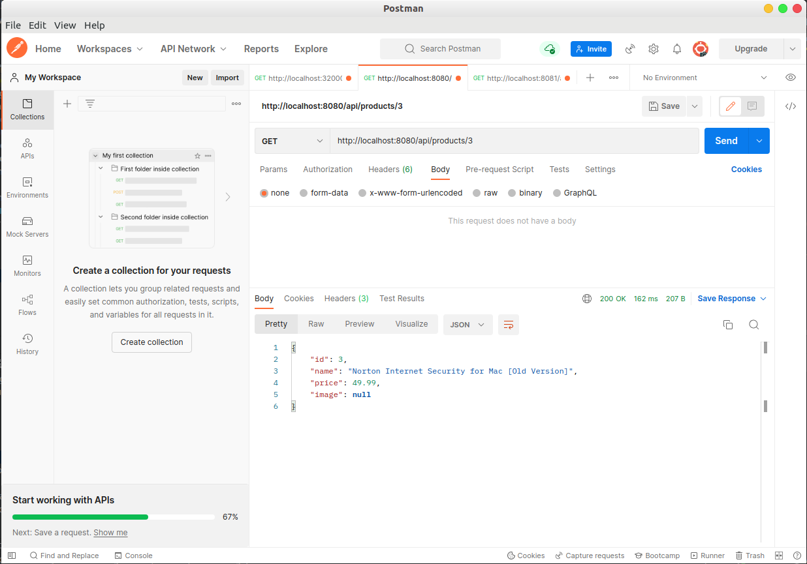

+ carts-service
  `POST: /api/carts`(创建新购物车)

  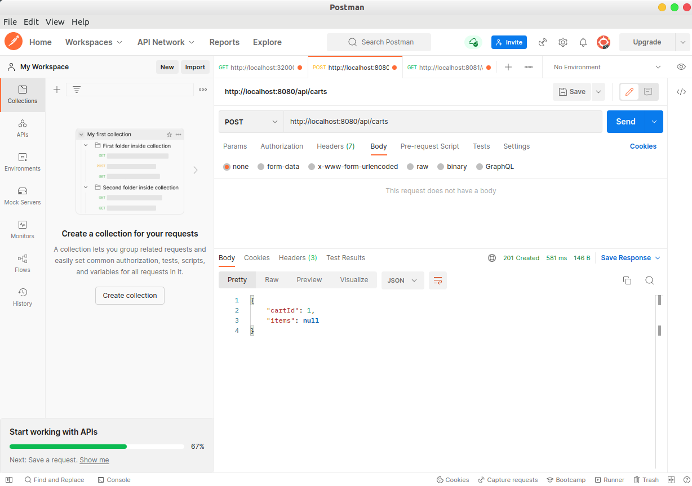

  `POST: /api/carts/{CartId}` RequestBody:Item(添加购物车)

  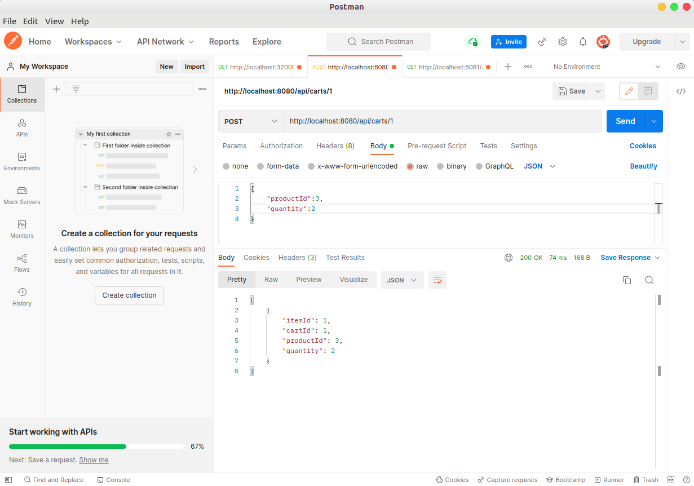

  `POST: /api/carts/checkout/{CartId}`(这里本质是发送了一条message给orderservice处理去了)

  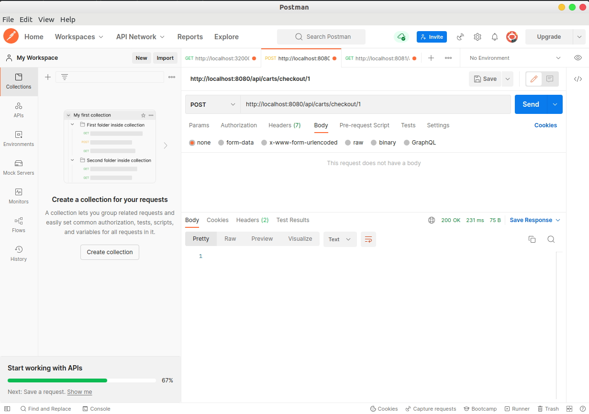

  `GET: /api/carts/checkout/{cartId}`

  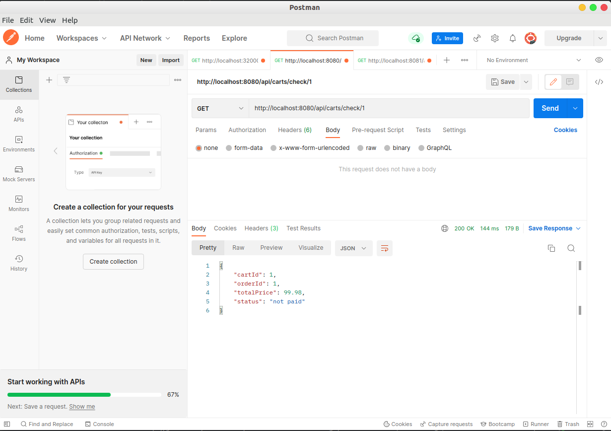

至此所有流程已经全部跑通，**订单生成以及持续获得订单状态是order-service和carts-service通过message channel以及spring integration配合完成，order-service其实并不囊括在整个微服务中**(我根本没有将其注册到eureka)

## 特性阐释

+ Responsive

  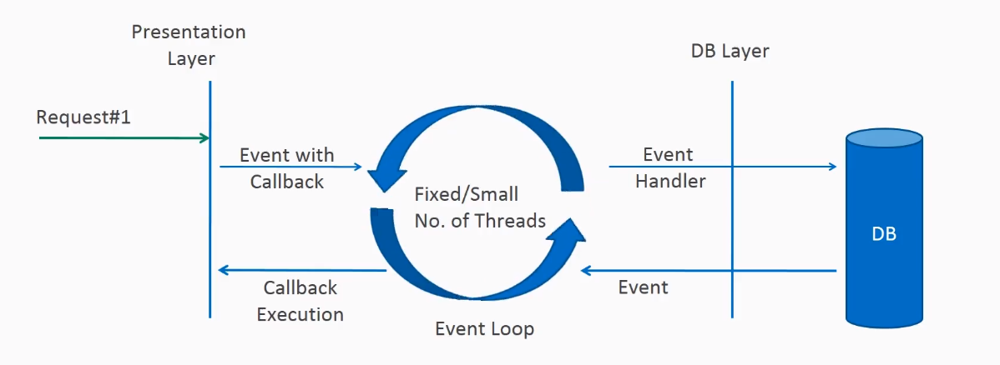

    + 借助spring-webflux，实现了上图，同时使用了spring-data-r2dbc，在数据库层也实现了Non-blocking

+ Resilient

    + 数据库宕机，可以通过配置集群解决，

    + 服务实例宕机，借助了Hystrix，当gateway无法forward时，让我们的用户前往合作伙伴进行购买，如下图

      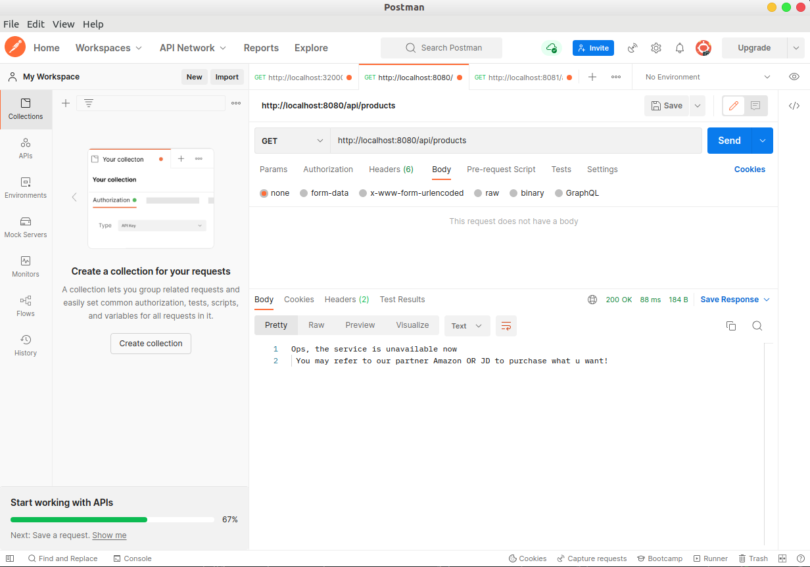

    + eureka和gateway宕机，都是可以依靠备份和集群的方式解决。

+ Elastic

    + 微服务架构保证了最基本的扩展性，同时借助eureka，又保证了各个服务之间的可见性。

+ Message-Driven

    - 在cart-service中新添checkout的url，用户可以通过指定购物车id进行结算，将cartId通过streambridge传给order-service，后者注入一个Consumer<Cart>, 将cart转换成Order，计算价格并且持久化到数据库，并且提供通过CartId查询Order的接口。
    - 将counter业务集成到delivery-service上，通过消费送来的cart，拿取其中items，再查库计算。

## 杂项
### 压力测试

+ 下面报告的材料以及相关文件见，生成了**很美观的网页**
    + `JmeterFiles`
    + `single-test-report`
    + `mult-test-report`

+ single-test压力测试结果

    + 与之前的aw04的对比，同样是获得一部分product信息，在docker化限制一部分计算资源的结果如下（截图自aw04）

      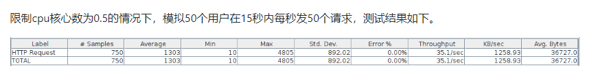

    + 新的结果如下

      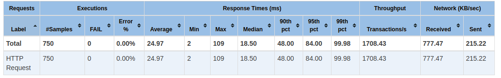

    + 在不考虑边际效应情况下，同时考虑到内存不在此次实验中成为瓶颈，可以看到responsive的设计使得整个系统大约快了**四倍**。吞吐量不太一样是因为amazon的数据集很多都缺斤少两，在输出时进行了过滤。

    + 多个服务的联动测试

+ mult-test压力测试结果

    + 之前的aw04并没有同时对多个url进行压测，不够**贴近用户使用**，现在模拟10个用户同时进行查询以及添加购物车的行为，测试结果如下

      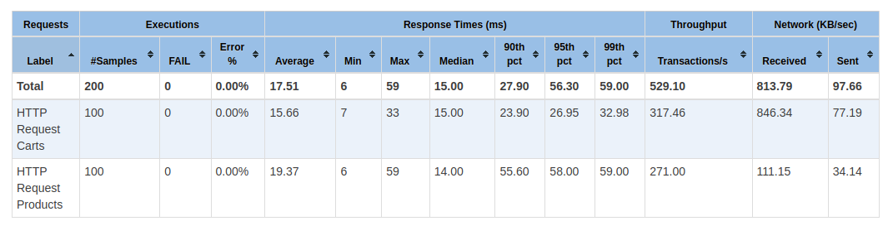

      可以看到有非常好的响应时间。为什么选择只测试10个user循环10次呢？

    + 因为在多次测试过程中我们发现

        + R2DBC目前还没有很成熟的ORM机制，导致我存储的itemId不方便设置，如果是使用JPA框架，我存储时记录的id会自增。但是R2DBC遇到这种情况会不能够正确进行持久化。
        + 倘若我们自己在后端维护Id，我想到的有两种情况，第一可以手动维护自增。的id，第二是每次拿到最大id的item，但是这两者都会出现**并发问题**。
        + 当我使用了volatile保证了内存可见性之后（可以说是下策），当并发数上升到50以上时，我的断路器（`Hystrix`）有概率会报一个拿不到信号量的错误。随着并发量上升，这个概率也会上升。目前google好像上没有找到这个问题解法，同时这个bug也难以复现。所以最终将并发量控制在10。
        + 因为能力有限，以及各个组件目前对reactive programming可能支持的不是很好，抛开网关后，得益于responsive的设计，吞吐量还是很高的。

### 关于R2DBC

#### R2DBC与JPA

+ R2DBC 不支持One To Many，不支持ORM，以及对Repository那一套支持较差，写起来不如JPA框架方便。

+ @Transient无用，得用@ReadOnlyProperties来ignore一些字段

+ TLS握手问题，与mysql的一些版本不兼容

+ save会时不时出问题(https://github.com/spring-projects/spring-data-r2dbc/issues/218)

+ 但是也只有借助它，我才能够全程Non-blocking

### 关于Reactor Core

+ 我感受到了从命令式编程到声明式编程学习曲线的**陡峭**，因为reactive programing这一套给我的感觉就是**放任操作系统来进行并发**，是上学期java课最后讲并发讲到最后一种**无锁设计**的感觉。同时从流，对象，消费，这些个概念，也让它强迫码农真正去面向对象思考。

### 参考网站

https://github.com/austinwang1121/lite-rx-api-hands-on/

https://tech.io/playgrounds/929/reactive-programming-with-reactor-3

**https://gatheca-george.medium.com/spring-webflux-using-relational-database-mysql-postgresql-fcc5e487f57f**