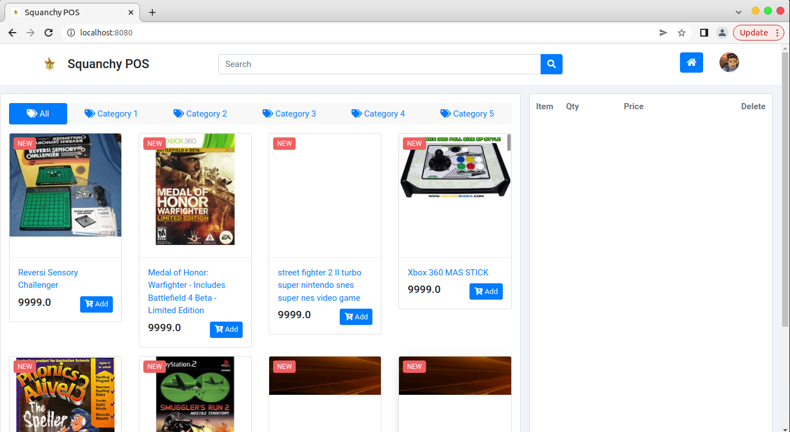

# aw06

[Amazon Review Data (2018)](https://nijianmo.github.io/amazon/index.html) has a huge products metadata set of multiple categories.

|category| reviews | metadata |
|--| -- | -- |
|Amazon Fashion|reviews (883,636 reviews)|metadata (186,637 products)|
|All Beauty|reviews (371,345 reviews)|metadata (32,992 products)|
|Appliances|reviews (602,777 reviews)|metadata (30,459 products)|
| ... |
|Tools and Home Improvement|reviews (9,015,203 reviews)|metadata (571,982 products)|
Toys and Games|reviews (8,201,231 reviews)|metadata (634,414 products)|
Video Games|reviews (2,565,349 reviews)|metadata (84,893 products)|

Please finish the following tasks:

- Download no less than two categories of these metadata.
- Referring the example code in this repo, convert each line in the downloaded files into a POJO of `Product` class and save the object in a database like MySQL. 
- Integrate the database containing Amazon products with your own AW04 project and build an Amazon WebPOS system.

And, of course, always try to make the system run as fast as possible.

+ 最终效果

+ 主要步骤
    + 使用split命令分割下载好的亚马逊的软件和游戏的元数据
    + 修改Product,从而可以利用spring data jpa将其轻松持久化到数据库
    + 写相关类（踩了很多坑比如`spring.jpa.hibernate.ddl-auto=create`和`spring.jpa.hibernate.ddl-auto=update`
    + 在aw04中将amazon的raw date转化成我们所需要的product
- 在探求懒加载的可能性